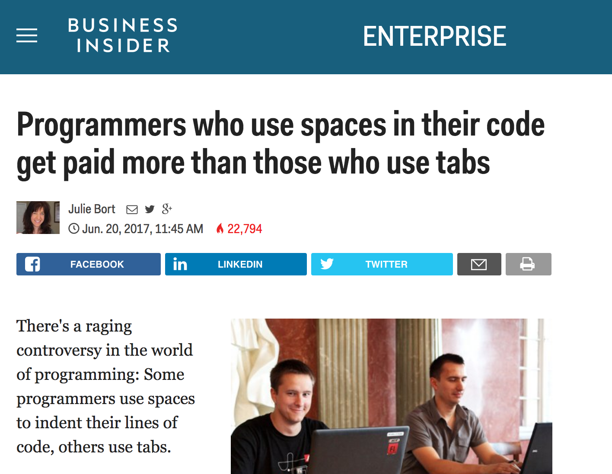
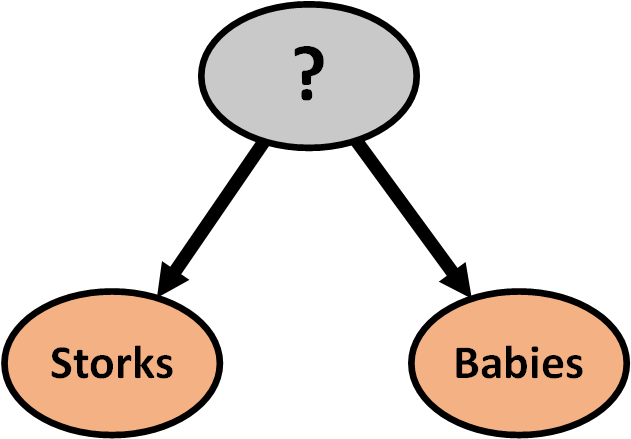
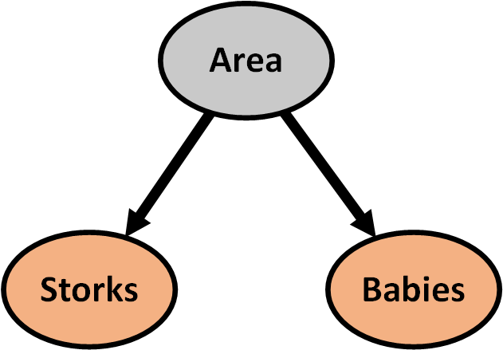
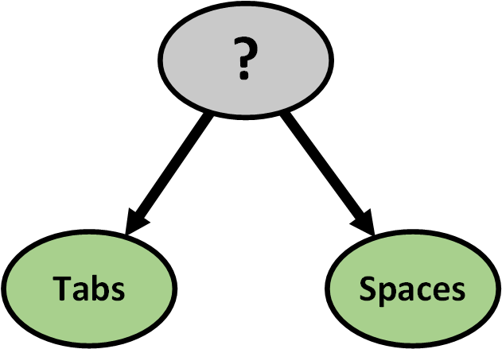
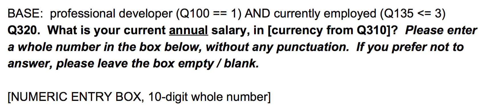
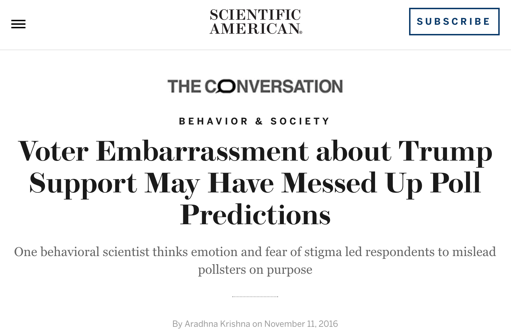
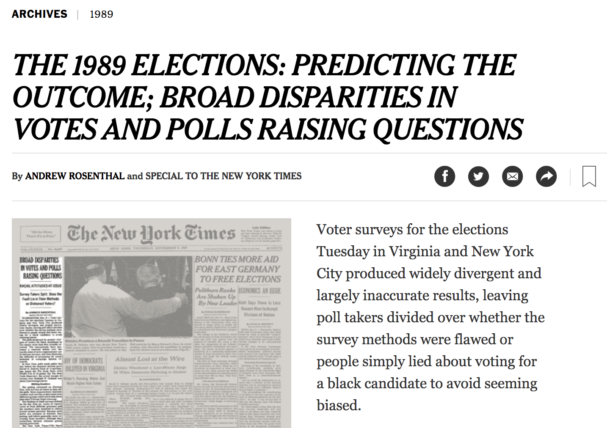

```{r setup, include=FALSE}
knitr::opts_chunk$set(warning=FALSE, message=FALSE, error=FALSE, dpi = 400,fig.cap = "", cache = T, echo=FALSE)
```

## The Mysterious Correlation {data-background="white"}
### A detective story

### Evelina Gabašová
### @evelgab


---------------------------------------------------------------------


---------------------------------------------------------------------


---------------------------------------------------------------------

```{r, fig.width=10, fig.height=6}
library(tidyverse)
library(scales)
library(magrittr)
library(ggthemes)
library(knitr)
theme_set(theme_minimal())

survey_results <- read_csv("developer_survey_2017/survey_results_public.csv")

tab_space_survey <- survey_results %>%
  filter(!is.na(TabsSpaces)) %>%
  mutate(TabsSpaces = factor(TabsSpaces, c("Spaces", "Tabs", "Both"))) %>%
  tidyr::extract(YearsCodedJob, "YearsCodedNumber", "(\\d+)", convert = TRUE) %>%
  replace_na(list(YearsCodedNumber = 0))
tab_space_survey2 <- 
  tab_space_survey %>%
  mutate(YearsCodedGroup = case_when(tab_space_survey$YearsCodedNumber < 5 ~ "<= 5 years",
                                     tab_space_survey$YearsCodedNumber <= 10 ~ "6-10",
                                     tab_space_survey$YearsCodedNumber <= 15 ~ "11-15",
                                     TRUE ~ "15+"),
         YearsCodedGroup = reorder(YearsCodedGroup, YearsCodedNumber, mean)) %>%
  filter(Professional == "Professional developer")
tab_space_survey <- tab_space_survey2

# Plot the original finding

survey_set_to_plot <- tab_space_survey %>%
  filter(!is.na(Salary))

survey_set_to_plot %>%
  group_by(TabsSpaces, YearsCodedGroup) %>%
  summarize(MedianSalary = median(Salary), Observations = n(),
            MeanYears = mean(YearsCodedNumber)) %>%
  ungroup() %>%
  ggplot(aes(YearsCodedGroup, MedianSalary,
             group = TabsSpaces, color = TabsSpaces)) +
  geom_line(size = 2, alpha = 0.8) +
  scale_y_continuous(labels = dollar_format()) +
  expand_limits(y = 0) +
  labs(color = "Uses",
       x = "Number of years someone coded as part of their job",
       y = "Median annual salary (US Dollars)",
       title = "Salary for developers who use tabs and spaces",
       subtitle = paste(comma(nrow(survey_set_to_plot)), "professional developers in the 2017 Stack Overflow Developer Survey"))  +
  theme_minimal(base_size = 20) 
```


```{r}
# Further preprocessing
survey_set <- tab_space_survey %>%
  filter(Professional == "Professional developer") %>%
  filter(!is.na(Salary)) %>%
  mutate(Country = forcats::fct_lump(Country, 5))
```

---------------------------------------------------------------------



---------------------------------------------------------------------


---------------------------------------------------------------------


<h1 class="meme"> Correlation is not causation! </h1>

<!-- Yes, ok. But that's not the whole story, can go further? -->

---------------------------------------------------------------------

## Correlation and causation

<!--
A correlation is the extent to which two variables are related to each other. That is, the extent to which they occur together. Like flowers and Spring – they occur together. They are correlated. But it can not be said that flowers bring the Spring.

A causal relationship is when the change in one variable leads to a change in another. Like the temperature of water and the speed at which ice melts – change the former and the latter will change, as well.

So how does it look in this case?
- incentives? this clearly doesn't work
- as an employer, should you put tabs into code style to have cheaper employees?
- should you use spaces to raise your salary?

' The problem with correlation - symmetric relationship, doesn't mean causation
' it only says that things appear together

correlation doesn't mean causation but absence of correlation is a strong evidence
against causal effect
-->

---------------------------------------------------------------------

<h1> Everyone loves a nice correlation! </h1>


---------------------------------------------------------------------


<!-- Do you exercise? -->

---------------------------------------------------------------------


<!-- Who likes chocolate? -->

---------------------------------------------------------------------


<!-- Who holds university degree? -->

---------------------------------------------------------------------


<!-- Do you eat vegetables? -->

---------------------------------------------------------------------

## {data-background="images/salad.gif"}


---------------------------------------------------------------------


<!--1976 number of incarcerated prisoners ~ crime rate -> let's release people from prisons -->

---------------------------------------------------------------------

##  {data-background="images/causal_language.gif"}

<br/><br/><br/><br/><br/><br/><br/><br/><br/>

<h1><div class="meme">
Causal language 
<br/>
for correlation data 
</div></h1>


---------------------------------------------------------------------

```{r, fig.width=10, fig.height=6}

tab_space_survey2 <- survey_results %>%
  filter(!is.na(TabsSpaces)) %>%
  mutate(TabsSpaces = factor(TabsSpaces, c("Spaces", "Tabs", "Both"))) %>%
  tidyr::extract(YearsCodedJob, "YearsCodedNumber", "(\\d+)", convert = TRUE) %>%
  replace_na(list(YearsCodedNumber = 0))
tab_space_survey3 <- 
  tab_space_survey2 %>%
  mutate(YearsCodedGroup = case_when(tab_space_survey2$YearsCodedNumber < 5 ~ "<= 5 years",
                                     tab_space_survey2$YearsCodedNumber <= 10 ~ "6-10",
                                     tab_space_survey2$YearsCodedNumber <= 15 ~ "11-15",
                                     TRUE ~ "15+"),
         YearsCodedGroup = reorder(YearsCodedGroup, YearsCodedNumber, mean)) %>%
  filter(Professional == "Professional developer")

tab_space_survey3 %>%
  filter(!is.na(Salary)) %>%
  group_by(TabsSpaces, YearsCodedGroup) %>%
  summarize(MedianSalary = median(Salary), Observations = n(),
            MeanYears = mean(YearsCodedNumber)) %>%
  ungroup() %>%
  ggplot(aes(YearsCodedGroup, MedianSalary,
             group = TabsSpaces, color = TabsSpaces)) +
  geom_line(size = 2, alpha = 0.8) +
  scale_y_continuous(labels = dollar_format()) +
  expand_limits(y = 0) +
  labs(color = "Uses",
       x = "Number of years someone coded as part of their job",
       y = "Median annual salary (US Dollars)",
       title = "Salary for developers who use tabs and spaces",
       subtitle = paste(comma(nrow(survey_set)), "professional developers in the 2017 Stack Overflow Developer Survey"))  +
  theme_minimal(base_size = 20) 

```

---------------------------------------------------------------------

## Things to check

- correlation or causation (randomised study?)
- small sample size
- result by chance
- hidden cause (latent variable)

---------------------------------------------------------------------

## Sample size?

```{r}
table(tab_space_survey3$YearsCodedGroup, tab_space_survey3$TabsSpaces) %>% kable
```

---------------------------------------------------------------------

## Sample size

```{r, fig.width=5, fig.height=3}
counts <- table(tab_space_survey3$YearsCodedGroup, tab_space_survey3$TabsSpaces) %>% 
  reshape::melt() %>%
  rename(Years = Var.1, Indentation = Var.2, Count = value)
counts$Years <- forcats::fct_relevel(counts$Years, "<= 5 years", "6-10", "11-15", "15+")
ggplot(counts, aes(Indentation, Years)) +
  geom_tile(aes(fill = Count), color = "#ffeda0") +
  scale_fill_gradient(low = "#ffeda0", high = "#f03b20") +
  xlab("Indentation") +
  ylab("Years coded") +
  labs(fill = "Count")+
  theme_minimal(base_size = 18) 

```

---------------------------------------------------------------------

## Result by chance?

---------------------------------------------------------------------

## Hidden cause?

---------------------------------------------------------------------

## Do storks deliver babies?


<br/>
<p style="text-align:right"><small>Source: Claude Covo-Farchi</small></p>

<!--
My favourite example
is the legend true? How can we deal with it statistically?
How can we disprove this?
-->

---------------------------------------------------------------------

### Testing the hypothesis

---------------------------------------------------------------------

```{r, fig.width=6, fig.height=4}
storkdata <- read_csv("storks.csv")
ggplot(storkdata, aes(x=`Storks (pairs)`, y=`Birth rate (10^3/yr)`)) +
  geom_point(size=3) + 
  geom_smooth(method='lm', se = FALSE, size=2) +
  ggtitle("Stork pairs and birth rate") +
  labs(subtitle=paste("Correlation coefficient =", 
                      cor(storkdata$`Storks (pairs)`, storkdata$`Birth rate (10^3/yr)`) %>% round(digits = 3), 
                      ", p-value =",
                      (cor.test(storkdata$`Storks (pairs)`, storkdata$`Birth rate (10^3/yr)`))$p.value %>% round(digits=4)) ) +
  theme_minimal(base_size = 18) 
```
<small>Matthews, R. (2000), Storks Deliver Babies (p= 0.008). Teaching Statistics, 22: 36–38. </small>

---------------------------------------------------------------------


---------------------------------------------------------------------

 

---------------------------------------------------------------------

```{r, fig.width=6, fig.height=4}
ggplot(storkdata, aes(x=`Storks (pairs)`, y=`Area(km2)`)) +
  geom_point(size=3) + 
  geom_smooth(method='lm', se = FALSE, size=2) +
  ggtitle("Stork pairs and country area") +
  theme_minimal(base_size = 18) 
```

---------------------------------------------------------------------

```{r, fig.width=6, fig.height=4}
ggplot(storkdata, aes(x=`Birth rate (10^3/yr)`, y=`Area(km2)`)) +
  geom_point(size=3) + 
  geom_smooth(method='lm', se = FALSE, size=2) +
  ggtitle("Birth rate and country area") +
  theme_minimal(base_size = 18) 
```

---------------------------------------------------------------------




---------------------------------------------------------------------

## Correlation and causation

- Randomised experiments
- A/B testing

---------------------------------------------------------------------

## Correlation and causation
### from observational data

Possible, but we need a lot of assumptions

- know all the variables
- know the right model

<br/>

### do-calculus

---------------------------------------------------------------------



---------------------------------------------------------------------

### Predicting salary with linear regression

* Country
* Years of programming experience
* Tabs and spaces usage
* Developer type and language 
* Level of formal education (e.g. bachelor’s, master’s, doctorate)
* Whether they contribute to open source
* Whether they program as a hobby
* Company size

---------------------------------------------------------------------

```{r}
library(stringr)
library(forcats)
library(ggrepel)

dev_types <- survey_set %>%
  select(Respondent, DeveloperType) %>%
  unnest(Type = str_split(DeveloperType, "; ")) %>%
  mutate(Type = fct_recode(Type,
                           "Developer with stats/math background" = "Developer with a statistics or mathematics background",
                           "DevOps" = "DevOps specialist",
                           "Embedded developer" = "Embedded applications/devices developer")) %>%
  transmute(Respondent, Type, TypeCategory = "DeveloperType")

languages <- survey_set %>%
  select(Respondent, HaveWorkedLanguage) %>%
  unnest(Type = str_split(HaveWorkedLanguage, "; ")) %>%
  transmute(Respondent, Type, TypeCategory = "Language")

person_dev_types <- dev_types %>%
  bind_rows(languages) %>%
  inner_join(survey_set, by = "Respondent") %>%
  group_by(Type)

# Include each of the developer types that has at least 200 people
all_dev_types <- person_dev_types %>%
  filter(!is.na(Type)) %>%
  select(Respondent, Type) %>%
  ungroup() %>%
  mutate(Value = 1) %>%
  spread(Type, Value, fill = 0)

prepared_data <- tab_space_survey %>%
  group_by(Country) %>%
  filter(n() >= 500) %>%
  ungroup() %>%
  filter(Salary >= 1000,
         !CompanySize %in% c("I prefer not to answer", "I don't know"),
         FormalEducation != "I prefer not to answer") %>%
  mutate(TabsSpaces = relevel(TabsSpaces, "Tabs"),
         OpenSource = str_detect(ProgramHobby, "both|open source"),
         Hobby = str_detect(ProgramHobby, "both|hobby")) %>%
  select(Respondent, Country, Salary, YearsCodedNumber, TabsSpaces, FormalEducation, OpenSource, Hobby, CompanySize) %>%
  inner_join(all_dev_types, by = "Respondent") %>%
  select(-Respondent)

library(broom)
basic_model <- lm(log(Salary) ~ 0 + ., data = prepared_data)
coefficients <- basic_model %>%
  tidy(conf.int = TRUE) %>%
  mutate(estimate = exp(estimate) - 1) %>%
  filter(term %in% c("YearsCodedNumber", "TabsSpacesSpaces"))
```
## What happens if we remove Tabs and Spaces?

---------------------------------------------------------------------

## {data-background="images/bored-kanye.gif"} 

---------------------------------------------------------------------

```{r}
data_with_tabspaces <- 
  prepared_data %>%
  filter(Country == "United States") %>%
  select(-Country)

data_without_tabspaces <- 
  data_with_tabspaces %>%
  select(-TabsSpaces)

lm_with_tabspaces <- lm(log(Salary) ~ ., data = data_with_tabspaces)
lm_without_tabspaces <- lm(log(Salary) ~ ., data = data_without_tabspaces)
```

### Diving deeper into linear regression

* **Full model** with the information on tabs and spaces included 
* **Reduced model** without the information on tabs and spaces

---------------------------------------------------------------------

### Coefficient of determination

how much variance in salary can the model explain

| Model  | Coefficient of determination $R^2$ | Adjusted $R^2_{adj}$ |
|---|---|---|
| Full model  | `r round(summary(lm_with_tabspaces)$r.squared,4)`  | `r round(summary(lm_with_tabspaces)$adj.r.squared,4)` |
| Reduced model  | `r round(summary(lm_without_tabspaces)$r.squared, 4)`  | `r round(summary(lm_with_tabspaces)$adj.r.squared,4)` |

<!-- So the information doesn't contribute much -->

---------------------------------------------------------------------

## Collinearity?

---------------------------------------------------------------------

## What changed in the reduced model?

```{r}
p_values_with <- summary(lm_with_tabspaces)$coefficients[,4] %>% as.data.frame
p_values_with$Variable <- rownames(p_values_with)
colnames(p_values_with) <- c("p-value with", "Variable")
p_values_without <- summary(lm_without_tabspaces)$coefficients[,4] %>% as.data.frame
p_values_without$Variable <- rownames(p_values_without)
colnames(p_values_without) <- c("p-value without", "Variable")

p_values <- inner_join(p_values_with, p_values_without, by="Variable")
#ggplot(p_values, aes(x=`p-value with`, y=`p-value without`)) + geom_point()

# which significant variables saw their p-values drop at least 10-fold
differences <- p_values %>% filter(`p-value with`/`p-value without` > 10 & `p-value without` <= 0.05)
```

---------------------------------------------------------------------

## More significant in the reduced model

>- Years of programming experience
>- Contributing to open source
>- PHP

---------------------------------------------------------------------

## Open source?

---------------------------------------------------------------------

```{r open_source_salary, fig.width=12, fig.height=6}
us_open_source <- 
  survey_set %>%
  filter(Country == "United States") %>% 
  mutate(OpenSource = str_detect(ProgramHobby, "both|open source"))

us_open_source %>%  
  group_by(OpenSource, YearsCodedGroup) %>%
  summarize(MedianSalary = median(Salary), Observations = n(),
            MeanYears = mean(YearsCodedNumber)) %>%
  ungroup() %>%
  ggplot(aes(YearsCodedGroup, MedianSalary,
             group = OpenSource, colour = OpenSource)) +
  geom_line(size = 3, alpha = 0.8) +
#  scale_y_continuous(labels = dollar_format()) +
  expand_limits(y = 0) +
  scale_y_continuous(labels = dollar_format()) +
  labs(color = "Contributes to open source",
       x = "Number of years someone coded as part of their job",
       y = "Median annual salary (US Dollars)",
       title = "Salary differences between US developers based on open source contributions") +
  scale_colour_manual(values=tableau_color_pal(palette = "tableau10")(2)) +
  theme_minimal(base_size = 18) 
```

---------------------------------------------------

### Open source contributors use spaces more than tabs

```{r}
open_source_tabs_test <- table(us_open_source$OpenSource, us_open_source$TabsSpaces) %>% fisher.test()
```

<!-- People who do contribute to open source, they are more than twice as likely to use spaces rather than tabs. This difference is also statistically significant with p-value `r open_source_tabs_test$p.value` -->


```{r open_source_tabs_us, fig.width=8, fig.height=5}
us_open_source %>%
  ggplot(aes(x=OpenSource, fill=TabsSpaces)) + geom_bar(position="dodge") +
  labs(x = "Contributes to open source projects",
       y = "Count",
       fill = "Uses",
       title = "Indentation method and open source contributions",
       subtitle = "US developers") +
  scale_fill_manual(values=tableau_color_pal(palette = "tableau10")(3)) +
  theme_minimal(base_size = 18)
```

---------------------------------------------------------------------

```{r open_source_tabs_world, fig.width=8, fig.height=5}
survey_set %>%
  mutate(OpenSource = str_detect(ProgramHobby, "both|open source")) %>%
  ggplot(aes(x=OpenSource, fill=TabsSpaces)) + geom_bar(position="dodge") +
  labs(x = "Contributes to open source projects",
       y = "Count",
       fill = "Uses",
       title = "Indentation method and open source contributions",
       subtitle = "All developers") +
  scale_fill_manual(values=tableau_color_pal(palette = "tableau10")(3)) +
  theme_minimal(base_size = 18)
```

---------------------------------------------------------------------

## Potential explanation?

<!--
I think we're getting closer to potential causal explanations here. The main advantage of using tabs is that you can set how they are displayed in the IDE, with spaces the layout is fixed. This means that the same code can look very different for different people if using tabs. And when people start mixing the two, one person using tabs and other using spaces within the same file, it leads to a mess. My theory is that when diverse people are working on open source projects together without enforced coding style, the possible formatting mess is nudging people towards using spaces simply because the code is consistent for everyone. 

This is just one of possible theories, I didn't look to see if possibly language communities that use predominantly spaces (like Python or Ruby) are more active in open source. Again, correlation doesn't imply causation.
-->

---------------------------------------------------------------------

### Language effects?

```{r,fig.width=6, fig.height=3}

survey_set %>%
  filter(grepl("C#", HaveWorkedLanguage, fixed=T) ) %>%
  ggplot(aes(x=TabsSpaces, fill=TabsSpaces)) + geom_bar() + 
  scale_fill_manual(values=tableau_color_pal(palette = "tableau10")(3)) +
  theme_minimal(base_size=18) +
  theme(legend.position="none") +
  ggtitle("C#")

```

---------------------------------------------------------------------

### Language effects?

```{r,fig.width=6, fig.height=3}

language <- "Ruby"
survey_set %>%
  filter(grepl(language, HaveWorkedLanguage, fixed=T) ) %>%
  ggplot(aes(x=TabsSpaces, fill=TabsSpaces)) + geom_bar() + 
    scale_fill_manual(values=tableau_color_pal(palette = "tableau10")(3)) +
    theme_minimal(base_size=18) +
    theme(legend.position="none") +
    ggtitle(language)

```

---------------------------------------------------------------------

## Language and open source?

---------------------------------------------------------------------

## Tabs, spaces, open source & salary
### How does it fit together?

<!--
Now the question is, does open source work account for higher salaries of people who use spaces more than tabs? When we plot the salaries based on open source contributions and indentation method, we get a more complex picture compared to the original that compared only tabs and spaces.
-->

```{r open_source_tabs_salary, fig.width=12, fig.height=5}
us_open_source <- 
  survey_set %>%
  filter(Country == "United States") %>% 
  mutate(OpenSource = str_detect(ProgramHobby, "both|open source"))
  

pl <- us_open_source %>%  
  group_by(OpenSource, YearsCodedGroup, TabsSpaces) %>%
  summarize(MedianSalary = median(Salary), Observations = n(),
            MeanYears = mean(YearsCodedNumber)) %>%
  ungroup() %>%
  mutate(TabsSpacesOpenSource = paste(TabsSpaces, OpenSource, sep=" - ")) %>%
  ggplot(aes(YearsCodedGroup, MedianSalary,
             group = TabsSpacesOpenSource, colour = TabsSpacesOpenSource)) +
  geom_line(size = 3, alpha = 0.8) +
  scale_y_continuous(labels = dollar_format()) +
  expand_limits(y = 0) +
  labs(color = "Indentation - open source",
       x = "Number of years someone coded as part of their job",
       y = "Median annual salary (US Dollars)",
       title = "Salary differences between US developers",
       subtitle = "based on open source contributions and their use of tabs and spaces") +
  scale_color_manual(values=c("#98df8a", "#2ca02c", "#aec7e8", "#1f77b4","#ffbb78","#ff7f0e")) +
  theme_minimal(base_size = 18)
pl

```

---------------------------------------------------------------------

<!-- Overall, there is some effect but it still doesn't change the global picture: people who use spaces have generally higher salaries than people who use tabs. So is there something else at play as well?
-->
```{r fig.width=15, fig.height=8}
pl + theme_minimal(base_size=22)
```

---------------------------------------------------------------------

### Exploring salary distributions
#### Based on experience level

```{r salary_distribution_junior, fig.width=10, fig.height=6}
juniors <-
  survey_set %>%
  filter(YearsCodedGroup == "<= 5 years" & Country == "United States")

library(grid)

# Bimodal distribution!
juniors %>%
  ggplot(aes(Salary, colour=TabsSpaces, fill=TabsSpaces)) + 
  geom_density(alpha=0.3) +
  scale_fill_manual(values=tableau_color_pal(palette = "tableau10")(3)) +
  scale_colour_manual(values=tableau_color_pal(palette = "tableau10")(3)) +
  theme_minimal(base_size = 20) +
  geom_segment(aes(x = 67000, y = 2.2e-05, xend = 67000, yend = 2e-5), colour='black', size=1,arrow = arrow(length = unit(0.5, "cm"))) +
  geom_segment(aes(x = 112000, y = 1.25e-05, xend = 112000, yend = 1e-5), colour='black', size=1,arrow = arrow(length = unit(0.5, "cm"))) +
  labs(title = "Salary distribution for junior developers",
       y = "Density",
       fill = "Uses", colour = "Uses") +
  ylim(0, 2.6e-5) +
  scale_x_continuous(labels = dollar_format()) 

juniors <- 
  juniors %>% mutate(SalaryLevel = case_when(Salary <= 100000 ~ "Lower salary",
                                             TRUE ~ "Higher salary"))
```

<!--
How does this group of people differ from the rest? I looked at what makes them different across the questions in the survey and I used the $\chi^2$ test to see if the numbers of people in different categories were significantly different for tab and space users.
-->

---------------------------------------------------------------------

### What's different for these users?
... more statistical testing

---------------------------------------------------------------------

## {data-background="images/bored.gif"}

---------------------------------------------------------------------

### The importance of version control

```{r}

jrs <- juniors %>% 
  group_by(VersionControl) %>%
  filter(n() > 20) %>%
  ungroup()

table(jrs$VersionControl, jrs$SalaryLevel) %>% kable()
```

---------------------------------------------------------------------

## Version control and tabs/spaces

```{r}
test_result <- table(jrs$VersionControl, jrs$SalaryLevel) %>% chisq.test()
group_difference <- test_result$p.value

# There is a difference between people using different version control systems and their tabs/spaces usage
tabspace_version_diff_juniors <- table(jrs$VersionControl, jrs$TabsSpaces) %>% chisq.test() 
tabspace_version_diff_all <- table(survey_set$VersionControl, survey_set$TabsSpaces) %>% chisq.test() 
tabspace_version_diff_all
```

---------------------------------------------------------------------

<!--
Surprisingly, it turns out that the version control system usage is not independent of the indentation method across all developers worldwide, not just the junior US ones (with p-value `r tabspace_version_diff_all$p.value`)! This means we have quite a strong link between tabs, spaces and version control systems.
-->


---------------------------------------------------------------------

<!--
Let's have a closer look. Among all US developers, the two most common version control systems (with at least 200 users in the dataset) are Git and Team Foundation Server (TFS). What is their effect on developers' salaries? 
-->

### Version control and salary

```{r version_control_salary, fig.width=12, fig.height=6}
survey_set %>%
  filter(Country == "United States" & !is.na(VersionControl)) %>% 
  group_by(VersionControl) %>%
  filter(n() > 200) %>%
  ungroup() %>%
  group_by(VersionControl, YearsCodedGroup) %>%
  summarize(MedianSalary = median(Salary), Observations = n(),
            MeanYears = mean(YearsCodedNumber)) %>%
  ungroup() %>%
  ggplot(aes(YearsCodedGroup, MedianSalary,
             group = VersionControl, colour = VersionControl)) +
  geom_line(size = 3, alpha = 0.8) +
  scale_y_continuous(labels = dollar_format()) +
  expand_limits(y = 0) +
  labs(color = "Version control",
       x = "Number of years someone coded as part of their job",
       y = "Median annual salary (US Dollars)",
       title = "Salary differences between US developers based on version control") +
  scale_colour_manual(values=tableau_color_pal(palette = "tableau10")(2)) +
  theme_minimal(base_size = 20)
```

---------------------------------------------------------------------

<!--
People who use Git have higher salaries across all experience levels. Interesting insight, which might be also connected to our previous investigation into open source contributors. But most importantly, how does version control relate to tabs and spaces usage together with salary?
-->


```{r versioncontrol_tabs_salary, fig.width=12, fig.height=6}
survey_set %>%
  filter(Country == "United States" & !is.na(VersionControl)) %>% 
  group_by(VersionControl) %>%
  filter(n() > 200) %>%
  ungroup %>%
  group_by(VersionControl, YearsCodedGroup, TabsSpaces) %>%
  summarize(MedianSalary = median(Salary), Observations = n(),
            MeanYears = mean(YearsCodedNumber)) %>%
  ungroup() %>%
  mutate(TabsSpacesOpenSource = paste(TabsSpaces, VersionControl, sep=" - ")) %>%
  ggplot(aes(YearsCodedGroup, MedianSalary,
             group = TabsSpacesOpenSource, colour = TabsSpacesOpenSource)) +
  geom_line(size = 2, alpha = 0.8) +
  scale_y_continuous(labels = dollar_format()) +
  expand_limits(y = 0) +
  labs(color = "Indentation - version control",
       x = "Number of years someone coded as part of their job",
       y = "Median annual salary (US Dollars)",
       title = "Salary differences between US developers based on version control and indentation") +
  scale_color_manual(values=c("#2ca02c", "#98df8a", "#1f77b4","#aec7e8", "#ff7f0e", "#ffbb78")) +
  theme_minimal(base_size = 20)
```

---------------------------------------------------------------------

```{r fig.width=12, fig.height=6}
survey_set %>%
  filter(Country == "United States" & !is.na(VersionControl)) %>% 
  group_by(VersionControl) %>%
  filter(n() > 200) %>%
  ungroup %>%
  group_by(VersionControl, YearsCodedGroup, TabsSpaces) %>%
  summarize(MedianSalary = median(Salary), Observations = n(),
            MeanYears = mean(YearsCodedNumber)) %>%
  ungroup() %>%
  mutate(TabsSpacesOpenSource = paste(TabsSpaces, VersionControl, sep=" - ")) %>%
  ggplot(aes(YearsCodedGroup, MedianSalary,
             group = TabsSpacesOpenSource, colour = TabsSpacesOpenSource)) +
  geom_line(size = 2, alpha = 0.8) +
  scale_y_continuous(labels = dollar_format()) +
  expand_limits(y = 0) +
  labs(color = "Indentation - version control",
       x = "Number of years someone coded as part of their job",
       y = "Median annual salary (US Dollars)",
       title = "Salary differences between US developers based on version control and indentation") +
  scale_color_manual(values=c("#d3d3d3", "#d3d3d3", "#1f77b4","#e377c2", "#d3d3d3", "#d3d3d3")) +
  theme_minimal(base_size = 20)
```

<!--
Interestingly, version control system breaks the pattern of higher salaries being always associated with space users. 
Companies using Git have mostly higher salaries regardless of indentation method, at least for developers with up to 10 years of experience! People using tabs with Git have larger salary than people using spaces with TFS, across all experience levels. Within the Git using group, people using spaces still have higher salaries than people using tabs. But within the TFS group, the pattern is not that clear: people using spaces with TFS have the lowest salaries for some of the groups. 
-->

---------------------------------------------------------------------

<!--
Internationally, the picture is partly different but it seems that you probably don't want to be a programmer with 15+ years of experience and use spaces with TFS. 
-->

```{r versioncontrol_tabs_salary_world, fig.width=12, fig.height=6}
survey_set %>%
  filter( !is.na(VersionControl) & (VersionControl == "Git" | VersionControl == "Team Foundation Server")) %>% 
  group_by(VersionControl) %>%
  filter(n() > 500) %>%
  ungroup %>%
  group_by(VersionControl, YearsCodedGroup, TabsSpaces) %>%
  summarize(MedianSalary = median(Salary), Observations = n(),
            MeanYears = mean(YearsCodedNumber)) %>%
  ungroup() %>%
  mutate(TabsSpacesOpenSource = paste(TabsSpaces, VersionControl, sep=" - ")) %>%
  ggplot(aes(YearsCodedGroup, MedianSalary,
             group = TabsSpacesOpenSource, colour = TabsSpacesOpenSource)) +
  geom_line(size = 2, alpha = 0.8) +
  scale_y_continuous(labels = dollar_format()) +
  expand_limits(y = 0) +
  labs(color = "Indentation - version control",
       x = "Number of years someone coded as part of their job",
       y = "Median annual salary (US Dollars)",
       title = "Salary differences between all developers based on version control")  +
  scale_color_manual(values=c("#2ca02c", "#98df8a", "#1f77b4","#aec7e8", "#ff7f0e", "#ffbb78")) +
  theme_minimal(base_size = 20)

```

---------------------------------------------------------------------

### Git and Subversion

<!--
For completeness, I looked also at Subversion which was slightly more common than TFS internationally. Subversion doesn't again follow the same pattern of space users having overall larger salaries than tab users. Git + tab users have very similar salaries to Subversion + space users and Git + both tab and space users. 
-->


```{r versioncontrol_tabs_salary_world2, fig.width=12, fig.height=6}
survey_set %>%
  filter( !is.na(VersionControl) & (VersionControl == "Git" | VersionControl == "Subversion")) %>% 
  group_by(VersionControl) %>%
  filter(n() > 500) %>%
  ungroup %>%
  group_by(VersionControl, YearsCodedGroup, TabsSpaces) %>%
  summarize(MedianSalary = median(Salary), Observations = n(),
            MeanYears = mean(YearsCodedNumber)) %>%
  ungroup() %>%
  mutate(TabsSpacesOpenSource = paste(TabsSpaces, VersionControl, sep=" - ")) %>%
  ggplot(aes(YearsCodedGroup, MedianSalary,
             group = TabsSpacesOpenSource, colour = TabsSpacesOpenSource)) +
  geom_line(size = 2, alpha = 0.8) +
  scale_y_continuous(labels = dollar_format()) +
  expand_limits(y = 0) +
  labs(color = "Indentation - version control",
       x = "Number of years someone coded as part of their job",
       y = "Median annual salary (US Dollars)",
       title = "Salary differences between all developers based on version control")  +
  scale_color_manual(values=c("#2ca02c", "#98df8a", "#1f77b4","#aec7e8", "#ff7f0e", "#ffbb78")) +
  theme_minimal(base_size = 20)

```

---------------------------------------------------------------------

## Why is version control so important?

<!--
To sum it up, the combination of open source contributions and version control system usage accounts for at least some of the difference in salaries between tab and spaces users. This doesn't mean that you should start using Git and contribute to open source to get paid more (although it would be great if you did that anyway!). 

I believe these two factors together point more towards different environments and different types of companies, how traditional they are and how they use modern technologies. More traditional *old-school* companies that don't use Git and open source code seem to have lower salaries in general. The type of environment is hard to measure directly in a survey and both of these factors only point in this direction. 

This is definitely not the whole story and I'm sure there are other variables that shed some light into the tabs-spaces salary inequality. My conclusions are also based mainly on US developers where the effect is the clearest. Why I had issues with the salaries in some other countries is what I discsuss below.
-->

---------------------------------------------------------------------


------------------------------------------------------------------

### [github.com/evelinag/tabs-spaces-talk](https://github.com/evelinag/tabs-spaces-talk)

<!-- 
===========================================================================================
===========================================================================================
===========================================================================================
-->

# But can we trust the data? 

<!--
Over the whole analysis I concentrated mainly on US developers and their salaries. The reason is that when I was looking at distributions of salaries with respect to various other factors, one thing caught my attention because it didn't make much sense to me. The data I was working with contained only professional developers working full time, yet there was quite a large group of people who had very low annual salaries, below 3,000 USD. That by itself unfortunately wouldn't be strange because there is a lot of inequality worldwide. What was weird were the countries where people were reporting such low salaries.
-->

------------------------------------------------------------------

### Salary distribution

```{r fig.width=12, fig.height=7}
survey_all_countries <- tab_space_survey %>%
  filter(Professional == "Professional developer") %>%
  filter(!is.na(Salary))

survey_all_countries %>%
  ggplot(aes(x=Salary)) +
  geom_histogram() +
  theme_minimal(base_size = 20) 
```

------------------------------------------------------------------

```{r low_salaries_countries, fig.width=10, fig.height=7}

low_salary <- 
  survey_all_countries %>%
    filter(Salary < 3000) 

low_salary_countries <- 
  (low_salary$Country %>% 
    table %>% 
    sort(decreasing=T) %>% 
    as.data.frame())[1:10,] 
colnames(low_salary_countries) <- c("Country", "Number of developers")

low_salary_countries %>%
  ggplot(aes(x=Country, y=`Number of developers`, fill=Country)) + 
  geom_bar(stat="identity", position = "dodge")  +
  scale_fill_manual(values=tableau_color_pal(palette = "tableau10")(10)) +
  theme_minimal(base_size = 20) + 
  theme(legend.position="none", axis.text.x=element_text(angle=20, hjust=0.8)) +
  labs(title="Developers who report annual salary lower than $3,000") 

```

---------------------------------------------------------------------

<!--
The country with the largest number of not-so-well paid developers is India which makes sense in this context, the average salary in India is significantly lower than in OECD countries. But have a look the countries after India: Poland, Russia and even Germany may not have gigantic salaries but less than 3,000 USD for a full time developer is extremely low. 

I come from the Czech republic so I have some "domain knowledge" of the region - I had a suspicion what's happening in the data. So I checked the salary distribution of a couple of countries in Central and Eastern Europe and how do their distributions compare to countries in other parts of the world.
-->

```{r salary_normal_contries, fig.width=12, fig.height=6}
# Relatively standard distribution of salaries
survey_all_countries %>% 
  filter(Country %in% c("United Kingdom", "India", "France")) %>%
  ggplot(aes(x=Salary, group=Country, colour=Country, fill=Country)) +
  geom_density(alpha=0.3) + 
  scale_fill_manual(values=tableau_color_pal(palette = "tableau10")(3)) +
  scale_colour_manual(values=tableau_color_pal(palette = "tableau10")(3)) +
  theme_minimal(base_size = 20) +
  scale_x_continuous(labels = dollar_format()) +
  labs(y="Salary density estimation",
       title="Standard salary distribution")
```

---------------------------------------------------------------------

```{r salary_soviet_countries, fig.width=12, fig.height=6}
library(grid)
# Eastern Europe - salary is traditionally reported in monthly salary
# -> misread question
# -> peak at the beginning
survey_all_countries %>% 
  filter(Country %in% c("Poland", "Russian Federation", "Germany")) %>%
  ggplot(aes(x=Salary, group=Country, colour=Country, fill=Country)) +
  geom_density(alpha=0.3) + 
  geom_segment(aes(x = 4000, y = 3.5e-05, xend = 4000, yend = 3e-5), colour='black', size=1,arrow = arrow(length = unit(0.5, "cm"))) +
  scale_fill_manual(values=tableau_color_pal(palette = "tableau10")(3)) +
  scale_colour_manual(values=tableau_color_pal(palette = "tableau10")(3)) +
  theme_minimal(base_size = 20) +
  scale_x_continuous(labels = dollar_format()) +
  labs(y="Salary density estimation",
       title="Salary distribution in Central and Eastern Europe")
```
---------------------------------------------------------------------

## What's wrong?
<!--
Countries such as the UK and France and even India all have salary distributions with a single peak. On the other hand, all the Central and Eastern European countries have bimodal salary distributions (with two peaks). The first peak corresponds to the very low salary, and the second corresponds to a larger, more believable annual salary. It's less pronounced in Germany, more in Poland and much more in Russia. I checked a couple of other countries including Czech Republic and Ukraine and the trend holds across all of them. All countries from this region seem to have bimodal salary distribution. What's happening there? 

Based on my experience, the Czechs always discuss salary not in terms of the annual salary but in terms of the monthly salary. I have never ever heard any Czech person referring to their annual salary. I checked with a Polish friend and he told me the exact same story - nobody ever talks about annual salary, only about the monthly salary. Considering this, it seems likely that many people simply didn't read the survey question properly and reported their monthly salary instead, simply because that's the number they are used to think about.

Can we fix the data somehow? We can for example fit a mixture model to the data and multiply the low-salary group by 12 to get annual salary. This will create a salary distribution that is left-truncated but represents the actual salaries in the country better than the original distribution. Below is an example for Poland.
-->

---------------------------------------------------------------------



---------------------------------------------------------------------

```{r salary_poland, fig.width=12, fig.height=6}
library(grid)
# Eastern Europe - salary is traditionally reported in monthly salary
# -> misread question
# -> peak at the beginning
survey_all_countries %>% 
  filter(Country %in% c("Poland")) %>%
  ggplot(aes(x=Salary, colour = "#ff7f0e", fill = "#ff7f0e")) +
  geom_density(alpha=0.3) + 
  geom_segment(aes(x = 4000, y = 3.5e-05, xend = 4000, yend = 3e-5), colour='black', size=1,arrow = arrow(length = unit(0.5, "cm"))) +
  theme_minimal(base_size = 20) +
  scale_x_continuous(labels = dollar_format()) +
  labs(y="Salary density estimation",
       title="Salary distribution in Poland")+
  scale_colour_manual(values="#ff7f0e") +
  scale_fill_manual(values="#ff7f0e") +
  theme(legend.position="none") 
```

---------------------------------------------------------------------

```{r salary_adapted, fig.width=12, fig.height=6, results='hide', fig.keep='all'}
library(mclust)
res <- Mclust((survey_all_countries %>% filter(Country == "Poland"))$Salary)
#plot.Mclust(res, what="classification")

adapted_salaries <- survey_all_countries %>% filter(Country=="Poland") 
adapted_salaries$Group <- res$classification
adapted_salaries %<>%
  mutate(AdaptedSalary = case_when(Group == 1 ~ Salary * 12,
                            TRUE ~ Salary)) 

adapted_salaries %>%
  ggplot(aes(x=AdaptedSalary, colour = "#ff7f0e", fill = "#ff7f0e")) + 
  geom_density(alpha=0.3) +  
  theme_minimal(base_size = 20) +
  labs(y="Salary density estimation",
       x="Adjusted salary",
       title="Adjusted salary distribution in Poland") +
  theme(legend.position="none") +
  scale_x_continuous(labels = dollar_format()) +
  scale_colour_manual(values="#ff7f0e") +
  scale_fill_manual(values="#ff7f0e") 
```

---------------------------------------------------------------------

## Missing data

```{r}
developers <- tab_space_survey %>%
   filter(Professional == "Professional developer")
developers_with_salary <- 
  developers %>% filter (!is.na(Salary))
```

```{r missing_data,fig.width=10, fig.height=4}
missing_salary <- 
  developers %>% 
  mutate(IsMissing = ifelse(!is.na(developers$Salary), "Present", "Missing")) %>%
  mutate(OpenSource = str_detect(ProgramHobby, "both|open source"))

#missing_model <- glm(IsMissing ~ YearsCodedNumber + TabsSpaces + FormalEducation + OpenSource + CompanySize, data=missing_salary, family=binomial)
# Not a great fit
#summary(missing_model)

missing_salary %>%
  ggplot(aes(x=IsMissing, fill=IsMissing)) + 
  geom_bar() + 
  scale_fill_manual(values=tableau_color_pal(palette = "tableau10")(2)) +
  theme_minimal(base_size=18) +
  theme(legend.position="none") +
  ggtitle("Salary information") +
  xlab("") +
  coord_flip()
```

---------------------------------------------------------------------

### Statistics of missing data

- missing completely at random
- missing at random
- missing not at random

---------------------------------------------------------------------

### Missing completely at random


---------------------------------------------------------------------

### Missing at random


<!-- weight watchers example -->

---------------------------------------------------------------------

### Missing not at random


---------------------------------------------------------------------

## Missing data on salaries

typically missing at random or missing not at random

---------------------------------------------------------------------

## Data traps

- missing data
- wrong data 

<br />
<b>accidentally or deliberately </b>

---------------------------------------------------------------------



---------------------------------------------------------------------



<!-- New York mayoral elections in 1989 - David Dinkins (black) vs Rudolph Giuliani (white)

---------------------------------------------------------------------

## {data-background="images/confused-cat.gif"}

<!-- 
=====================================================================
-->

# Can you trust data?

<!-- Simple survey, so many problems! -->

---------------------------------------------------------------------


---------------------------------------------------------------------

## Interpretation
Machine learning as a service


---------------------------------------------------------------------

## Machine learning
as learning-by-association

---------------------------------------------------------------------

> "As much as I look into what’s being done with deep learning, I see they’re all stuck there on the level of associations. Curve fitting."

Judea Pearl


<!---------------------------------- --->

# Beyond "Correlation is not causation"

---------------------------------------------------------------------

##  {data-background="images/sherlock-tea.gif"}

---------------------------------------------------------------------

  


<h2> <div style="color: black; font-size:62pt" > Evelina Gabasova </div> </h2>
<h3> Consulting data detective </h3>
<h3> @evelgab </h3>
<h3>evelinag.com</h3>
